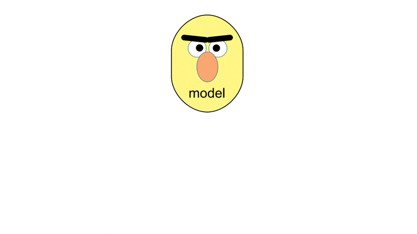

    <h1>Awesome Compression Safety</h1>
    

## Awesome LLM compression research papers and tools with a focus on safety

Quantization and other model compression techniques significantly improve efficiency, but may also compromise trustworthiness, fairness, and overall model reliability.

This repository provides a **curated list of papers, benchmarks, and resources** on the *undesired side effects* of model compression - particularly focusing on its impact on: **Fairness**, **Robustness**, **Calibration**,  **Toxicity and Safety**.

  

## Paper List

### Fairness (Monolingual & Multilingual)

- Fair-GPTQ: Bias-Aware Quantization for Large Language Models  
  Proskurina et al., 2025 [[Paper]](https://arxiv.org/abs/2509.15206)

- Can Model Compression Improve NLP Fairness  
  Xu & Hu, 2022 [[Paper]](https://arxiv.org/abs/2201.08542)

- A Comparative Study on the Impact of Model Compression Techniques on Fairness in Language Models  
  Ramesh et al., ACL 2023 [[Paper]](https://aclanthology.org/2023.acl-long.878/)

- The Impact of Model Compression on Fairness  
  Kamal, FLAIRS 2024 [[Paper]](https://journals.flvc.org/FLAIRS/article/download/135617/140005/260572)

- You Never Know: Quantization Induces Inconsistent Biases in Vision-Language Foundation Models  
  Slyman et al., 2024 [[Paper]](https://arxiv.org/abs/2410.20265)

- How Does Quantization Affect Multilingual LLMs?  
  Li et al., EMNLP Findings 2024 [[Paper]](https://aclanthology.org/2024.findings-emnlp.935/)

- Understanding the Unfairness in Network Quantization  
  Zhang et al., ICML 2025 [[Paper]](https://icml.cc/virtual/2025/poster/43689)

- Downsized and Compromised?: Assessing the Faithfulness of Model Compression  
  Kamal & Talbert, 2025 [[Paper]](https://arxiv.org/abs/2510.06125)

- The Effect of Model Compression on Fairness in Facial Expression Recognition  
  Stoychev & Gunes, 2022 [[Paper]](https://arxiv.org/abs/2201.01709)

---

### Robustness

- Benchmarking Post-Training Quantization in LLMs: A Comprehensive Taxonomy  
  Zhou et al., 2025 [[Paper]](https://arxiv.org/abs/2502.13178)

- A Comprehensive Evaluation of Quantization Strategies for Large Language Models  
  Smith et al., ACL Findings 2024 [[Paper]](https://aclanthology.org/2024.findings-acl.726/)

- BiLLM: Pushing the Limit of Post-Training Quantization for LLMs  
  Liu et al., 2024 [[Paper]](https://arxiv.org/abs/2402.04291)

- Exploiting LLM Quantization  
  Egashira et al., NeurIPS 2024 [[Paper]](https://proceedings.neurips.cc/paper_files/paper/2024/file/496720b3c860111b95ac8634349dcc88-Paper-Conference.pdf)

- A Comprehensive Review of Model Compression Techniques in Machine Learning  
  Dantas et al., 2024 [[Paper]](https://link.springer.com/article/10.1007/s10489-024-05747-w)

- Compression Scaling Laws: Unifying Sparsity and Quantization  
  Zhang et al., 2025 [[Paper]](https://arxiv.org/html/2502.16440v1)

- Towards Understanding Model Quantization for Reliable Deep Neural Network Deployment  
  Hu et al., 2023 [[Paper]](https://orbilu.uni.lu/bitstream/10993/59236/1/CAIN2023_quantization%20%281%29.pdf)

- Model Compression in Practice: Lessons Learned from Real Deployments  
  2024 [[Paper]](https://dl.acm.org/doi/10.1145/3613904.3642109)

---

### Calibration, Confidence & Calibration Data

- When Quantization Affects Confidence of Large Language Models?  
  Proskurina et al., NAACL 2024 [[Paper]](https://aclanthology.org/2024.findings-naacl.124/)

- An Underexplored Dilemma between Confidence and Calibration in Quantized Neural Networks  
  Xia et al., 2021 [[Paper]](https://arxiv.org/abs/2111.08163)

- On the Impact of Calibration Data in Post-Training Quantization and Pruning  
  Williams & Aletras, ACL 2024 [[Paper]](https://aclanthology.org/2024.acl-long.544/)

- Self-Calibration for Language Model Quantization and Pruning  
  Li et al., 2025 [[Paper]](https://arxiv.org/abs/2410.17170)

- Preserving LLM Capabilities through Calibration Data Curation: From Analysis to Optimization  
  He et al., NeurIPS 2025 [[Paper]](https://arxiv.org/abs/2510.10618)

- Beware of Calibration Data for Pruning Large Language Models  
  Ji et al., ICLR 2025 [[Paper]](https://openreview.net/forum?id=x83w6yGIWb)

- PD-Quant: Post-Training Quantization Based on Prediction Difference Metric  
  Liu et al., 2022 [[Paper]](https://arxiv.org/abs/2212.07048)

- Interpreting the Effects of Quantization on LLMs  
  Singh et al., 2025 [[Paper]](https://arxiv.org/pdf/2508.16785)

---

### Toxicity & Safety

- Beyond Perplexity: Multi-dimensional Safety Evaluation of LLM Compression  
  Xu et al., EMNLP Findings 2024 [[Paper]](https://aclanthology.org/2024.findings-emnlp.901/)

- Decoding Compressed Trust: Scrutinizing the Trustworthiness of Efficient LLMs Under Compression  
  Hong et al., ICML 2024 [[Paper]](https://arxiv.org/abs/2403.15447)

- Assessing Safety Risks and Quantization-Aware Safety-Patching Framework (Q-Resafe)  
  Patel et al., ICML 2025 [[Paper]](https://icml.cc/virtual/2025/poster/44278)

- HarmLevelBench: Evaluating Harm-Level Compliance and the Impact of Quantization on Model Alignment  
  Belkhiter et al., 2024 [[Paper]](https://arxiv.org/abs/2411.06835)

## Contributing

This is an active repository, and your contributions are always welcome! Before adding papers/tools to this awesome list, please make sure that:

- The paper is about **compression for** Large Language Models (LLMs), Vision-Language Models (VLMs), or Multimodal Large Language Models (MLLMs).
- The [Paper] link should point to the **arXiv abstract page** (not the PDF page) if the paper is posted on arXiv.
- If the paper is accepted, please list the **correct publication venue** instead of arXiv.
